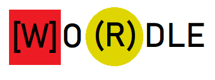

# kotlin-wordle

## What

This is the game of [wordle](https://www.nytimes.com/games/wordle/index.html) but I implemented it myself in a sub-optimized way just because I wanted to do some Kotlin. It uses a french dictionary and also it has some french-specific behaviours like when dealing with diacritics.

## Why

I just wanted to do some Kotlin, this language is very neat.

## How

Kotlin with Maven support. Maybe I will use ktor as a http server, who knows.

## And also

Why not check Github Actions? They are practical (I guess).
